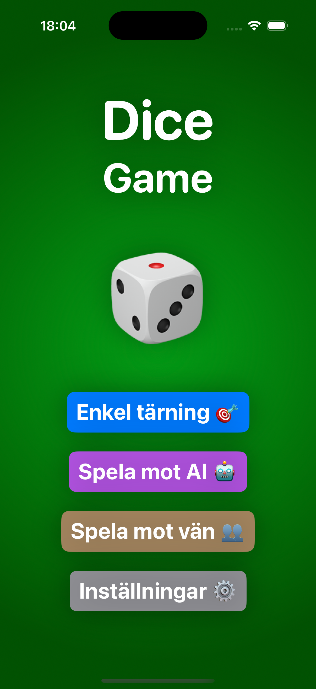
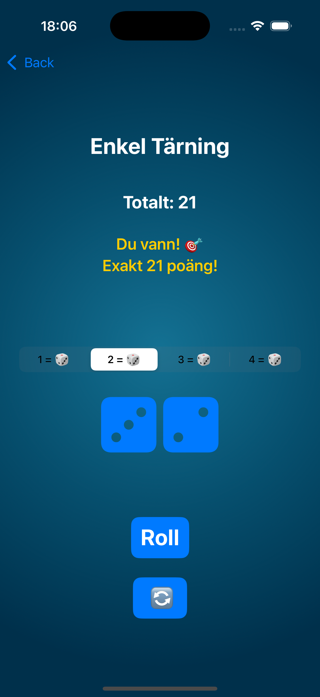
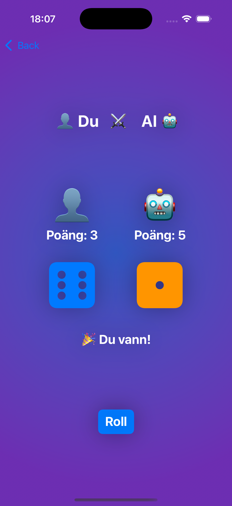
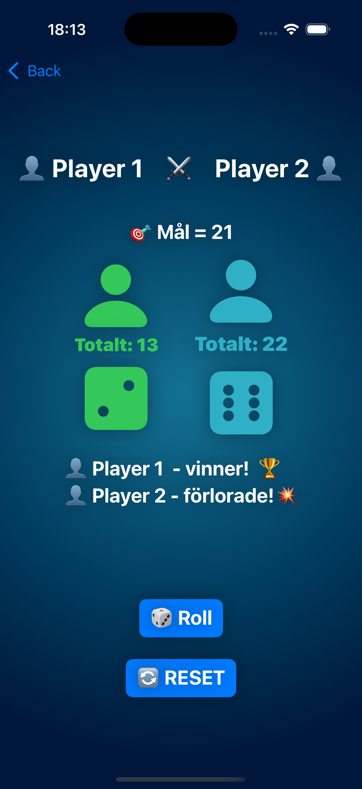

# DiceGame – SwiftUI iOS App

## Overview

Dice Game is a fun and stylish iOS app built with SwiftUI 5.0.
The game offers multiple ways to play dice – against yourself, a friend, or an AI opponent.
You can also customize your goal score, sound settings, and color theme via a sleek settings view.

---

## Features

🏠 Main Menu (ContentView)
- Modern NavigationStack layout.
- Choose between different game modes.
  - 🎯 Simple Dice
  - 🤖 Against AI
  - 👥 Play against a friend
- Dynamic background based on selected color theme.

---

## SettingsView

- Customize the game appearance and rules.
  - 🎯 Target score (11, 21, 30, 50, 100)
  - 🔊 Sound on/off
  - 🎨 Color theme (Blue, Green, Pink, Black)
- Reset to default settings.
-App information (developer, version, web link, etc.)

---

## ⚙️ Technical information

| Property        | Value         |
| -------------   |:-------------:|
| Developed in    | SwiftUI 5.0   |
| Minimum iOS ver | iOS 18.2      |
| Language        | Swedish 🇸🇪    |
| Settings storage| @AppStorage   |
| Sound           | AVFoundation  |

---

## Installation

1. Clone the project 

```bash 
git clone https://github.com/Jonasodiq/DiceGame 
pip install -r requirements.txt
```
2. Open the project in Xcode 16 or later.  
3. Build and run on simulator or physical iPhone device.

---

## Version

### Under development.

The project is actively under construction - new features, improvements and bug fixes are being added continuously.
> 💬 Ge gärna feedback eller förslag på förbättringar! >


## 📸 Screenshots

Here are some preview images of DiceGame in action:

<p float="left">
  
  
  
  
  
</p>


